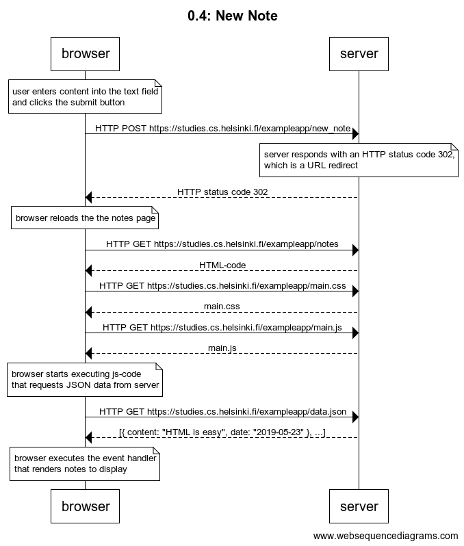
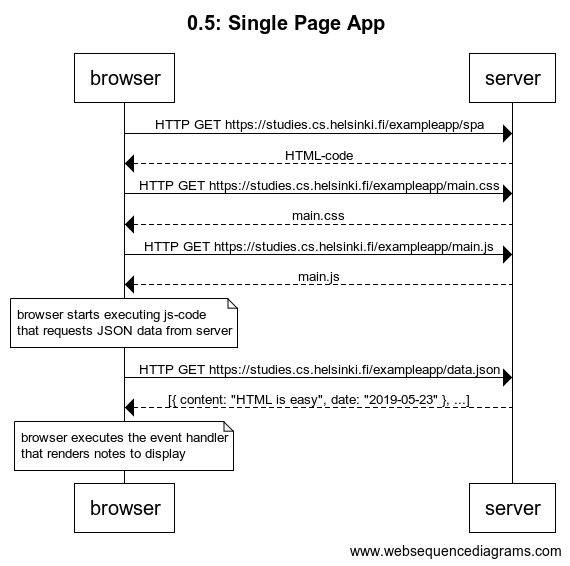
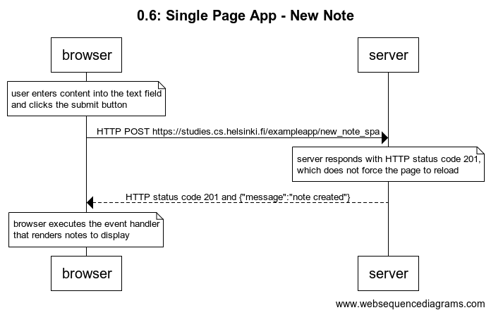

# [Part 0: Fundamentals of Web apps](https://fullstackopen.com/en/part0)

## 0.1: HTML
Review the basics of HTML by reading this tutorial from Mozilla: [HTML tutorial](https://developer.mozilla.org/en-US/docs/Learn/Getting_started_with_the_web/HTML_basics).

## 0.2: CSS
Review the basics of CSS by reading this tutorial from Mozilla: [CSS tutorial](https://developer.mozilla.org/en-US/docs/Learn/Getting_started_with_the_web/CSS_basics).

## 0.3: HTML forms
Learn about the basics of HTML forms by reading Mozilla's tutorial [Your first form](https://developer.mozilla.org/en-US/docs/Learn/HTML/Forms/Your_first_HTML_form).

## 0.4: New Note
Create a diagram depicting the situation where the user creates a new note on page https://studies.cs.helsinki.fi/exampleapp/notes by writing something into the text field and clicking the submit button.

### Solution: 

[0.4_new-note.txt](0.4_new-note.txt)

## 0.5: Single Page App
Create a diagram depicting the situation where the user goes to the single page app version of the notes app at https://studies.cs.helsinki.fi/exampleapp/spa.

### Solution: 

[0.5_spa.txt](0.5_spa.txt)

## 0.6: Single Page App - New Note
Create a diagram depicting the situation where the user creates a new note using the single page version of the app at https://studies.cs.helsinki.fi/exampleapp/spa.

### Solution: 

[0.6_spa-new-note.txt](0.6_spa-new-note.txt)